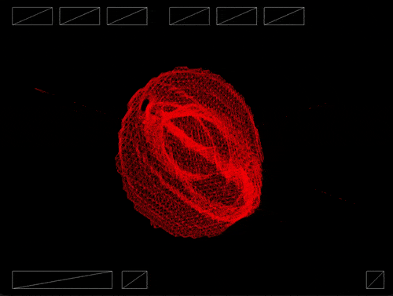

My version of the Cursor hackathon problem solution
- Code builds
- 3D model loading speed reduced by 5.6 times.
- Tier 1-2 documentation (not for Tier 3, but I started working on the graphical interface and stopped at the current version)

-------------
# Is this javascripts?😫

## 🎯 Hackathon Task Overview

Welcome to the **Cursor Reverse Engineering Challenge**! 

This task simulates a real-world scenario where you're given a legacy codebase that has fallen into disrepair. Your mission is to understand the codebase and revive the algorithm, identify and fix issues, optimize performance, and potentially add new features.

While the core algorithms are sound and functional, the code has accumulated various maintenance issues that prevent it from running properly. You will face various issues while diving into the codebase - it's up to you to discover potential bugs, missed optimization oportunities, usage scenarios, and if you can, implement aditional features!

## 🏆 Success Criteria (Tiered System)

You must demonstrate deep code understanding and create comprehensive documentation for each tier achieved.

### Tier 1: Make It Launch 🚀
**Objective**: Get the code compiling and running successfully
- Fix compilation errors and runtime failures
- Ensure the basic functionale works
- Document all issues found and fixes applied
- Create code documentation explaining the core algorithms

### Tier 2: Optimize Performance ⚡️
**Objective**: Improve code efficiency and maintainability
- Identify and resolve performance bottlenecks
- Clean up code inconsistencies and technical debt
- Implement optimizations while preserving functionality
- Document optimization decisions and their impact

### Tier 3: Add Features ✨
**Objective**: Extend functionality with new capabilities
- Dynamic rendering? Variations and new types? Deep zooms? Scan-line algo and raytracing?
- Add user interface improvements or configuration options
- Enhance the mathematical algorithms
- Document new features and their implementation

## 🎯 Participant Goals

1. **Fix the Code**: Identify and resolve all issues preventing successful execution
2. **Understand the Logic**: Demonstrate comprehension of the algorithms
3. **Create Documentation**: Produce comprehensive documentation of:
   - Code structure and algorithms
   - Issues found and solutions implemented
   - Optimization decisions and their rationale
   - Any new features added

## 🛠 Getting Started

### Prerequisites
- C compiler (GCC/Clang recommended)
- OpenGL development libraries
- GLFW library
- Build system (Make or CMake)

## 🔍 Common Challenges You'll Encounter

As you work through this codebase, you may encounter several types of issues:

- Build System Confusion
- Code Quality Issues
- Missing Dependencies
- Runtime Errors
- Performance Inefficiencies

Remember: The core algorithms are correct - the challenges are in the implementation and maintenance aspects!

## 📋 Submission Requirements

For each tier you complete, submit:

1. **Working Code**: The fixed/optimized/enhanced codebase
2. **Documentation**:
   - Code comments and README updates
   - Technical documentation explaining algorithms
   - Change log documenting all modifications
   - Performance analysis (for Tier 2+)
3. **Demonstration**: Screenshots/videos of the working application
4. **Process Documentation**: Description of your debugging process and problem-solving approach

## 🏅 Winner Selection Criteria

Winners will be selected based on:

1. **Code Quality**: Clean, well-documented, and maintainable solutions
2. **Technical Depth**: Demonstrated understanding of algorithms and optimizations
3. **Documentation Excellence**: Comprehensive and clear documentation
4. **Innovation**: Creative solutions and feature additions (Tier 3)
5. **Efficiency**: Performance improvements and optimization quality (Tier 2+)

## 💡 Tips for Success

1. **Start Small**: Understand what you are working with, begin with compilation issues before tackling optimizations
2. **Document As You Go**: Keep detailed notes of problems and solutions
3. **Test Frequently**: Run the application after each major change
4. **Read the Code**: Understand the algorithms before making changes
5. **Version Control**: Use git to track your changes and revert if needed

**Good luck!** 🌌
